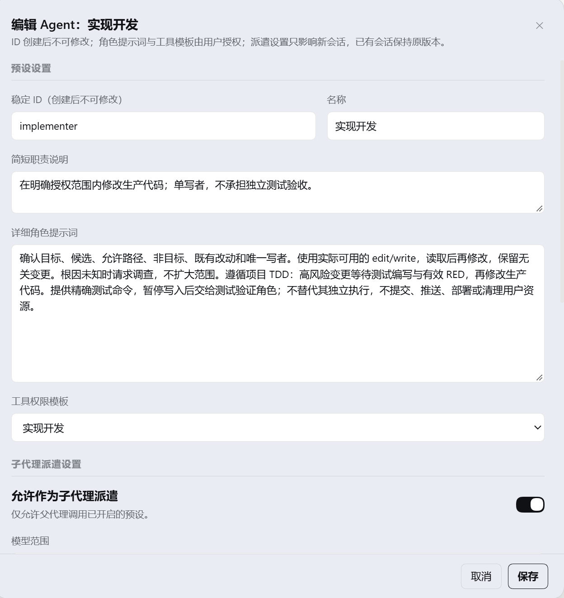
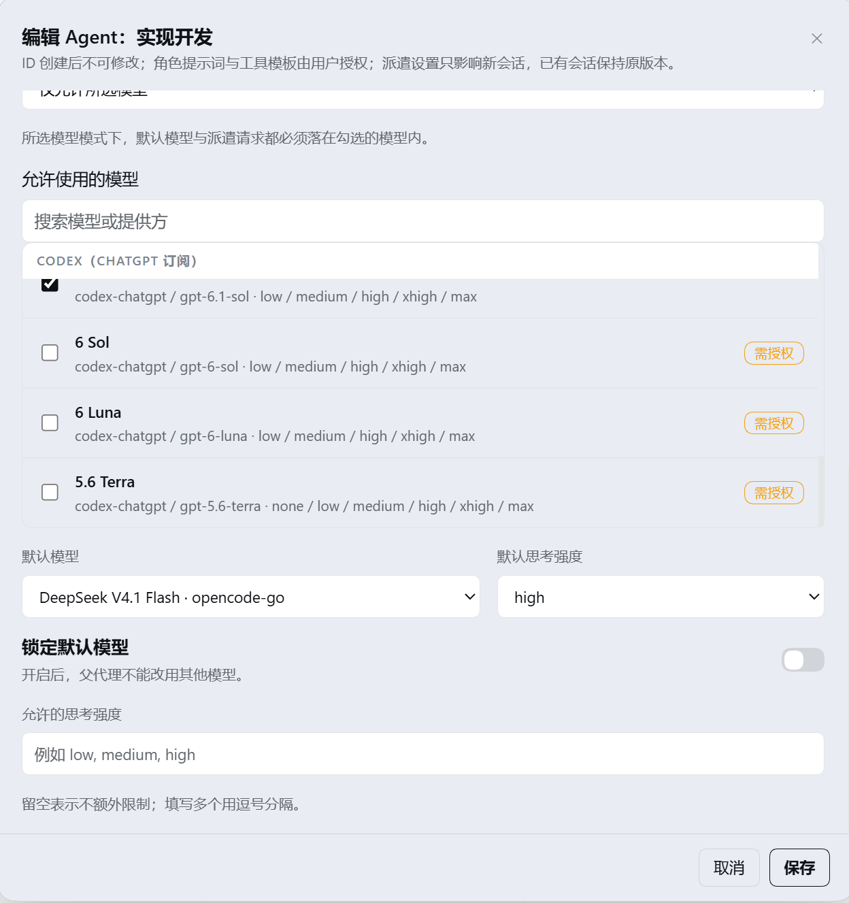

# Agent 管理（dsh-preset-dispatch）

> 为 DeepSeek Harness 提供的一个插件：把**角色预设编辑**与**子代理派遣授权**合并到一个页面、一个弹窗、一次保存里。
>
> A DeepSeek Harness plugin that unifies agent-preset editing and subagent-dispatch authorization in one place.

在 DSH 里，预设（角色）由原生机制管理，而"谁能派遣、能用哪些模型、用多大强度"是另一套设置。两者分散在不同位置，改一个角色的职责与它的派遣策略要来回切换，且缺少服务端约束——本插件把它们合并，并把**授权边界做在服务端**。

---

## 界面


卡片按原生预设的 `order` 排序（与 DSH 原生预设列表同一规则）；页脚显示版本与派遣摘要，`↑` / `↓` 调整顺序，「调用记录」查看派遣历史。



点卡片打开**一个**弹窗：上半是角色（稳定 ID、名称、职责说明、角色提示词、工具权限模板），下半是子代理派遣设置。



模型范围可选"跟随授权池"或"指定模型"；未在 DSH 全局授权池中的模型标注「需授权」，勾选时会被要求同时启用全局授权，避免在页面上绕过授权。

---

## 目录

- [界面](#界面)
- [它解决什么问题](#它解决什么问题)
- [功能总览](#功能总览)
- [验证状态](#验证状态)
- [受管角色](#受管角色)
- [安装](#安装)
- [快速上手](#快速上手)
- [授权与安全模型](#授权与安全模型)
- [数据与隐私](#数据与隐私)
- [兼容性](#兼容性)
- [常见问题](#常见问题)
- [开发与验证](#开发与验证)
- [许可](#许可)

---

## 它解决什么问题

| 原本 | 本插件 |
|---|---|
| 角色提示词、工具模板在一处；派遣开关、模型范围在另一处 | **一个弹窗**同时承载"预设设置"与"子代理派遣设置"，**一次保存** |
| 页面只做前端隐藏，越权请求仍可能生效 | **服务端强制所有权**：只有本插件管理的预设可被写入，其他预设完全只读 |
| 保存失败时"看起来什么都没发生" | **分项结果**：哪一部分已落盘、哪一部分待重试，逐项可见可重试 |
| 派遣期间撤权后，已发起的子代理仍会启动 | **启动前复核**：创建子代理前再次校验授权，撤权即拒绝并释放已创建的子代理 |
| 派遣历史只在内存里，重启即丢 | **持久化元数据**（最近 50 条），重启后仍在；中断的派遣标记为已中断 |
| 模型目录每次读取都要问提供方 | **目录缓存**（含并发合并与故障保留），但**授权永不走缓存** |

## 功能总览

### 1. 预设（角色）管理

- 设置分区「Agent 管理」：原生风格卡片网格，分「本插件管理」与「其他预设（只读）」两组，支持按名称/ID/说明搜索。
- 点卡片打开**一个**合并弹窗：上半「预设设置」、下半「子代理派遣设置」，一次保存；不使用折叠、不弹二级弹窗。
- 角色项：名称、稳定 ID（创建后不可改）、简短职责说明、详细角色提示词、工具权限模板、生效工具边界。
- 生命周期：新建、复制（可命名，拥有独立身份与独立策略）、删除（二次确认；默认预设与仍有活跃会话的被拒绝；删除前先停用派遣）。
- 排序：`↑`/`↓` 写入原生预设 `order`，管理页与 DSH 原生预设列表顺序一致。
- 受管预设以原生 `agent-managed-presets` 组声明，仍出现在 DSH 原生 Agent 预设列表。
- 内容哈希并发校验与版本递增：新会话使用新版本，已绑定会话保留旧版本。

### 2. 派遣授权与模型策略

- 每预设「允许作为子代理派遣」开关。
- 模型范围两种语义：跟随 Host 授权池 / 仅允许所选模型。
- 允许模型勾选，含模型搜索、未授权标注「需授权」、提供方读取失败提示。
- 默认模型（或继承父代理）、默认思考强度（或使用模型默认）、允许思考强度列表。
- 锁定默认模型：父代理不能改用其他模型。
- 全局项：DSH 子代理模型授权池（可写或只读）、最大派遣深度、失效策略行清理。
- 扩权需显式确认「同时启用 DSH 全局模型授权」，界面说明影响整个 Harness。
- 三层授权（目录可见性、全局池、预设列表）取交集，且**每次创建子代理前实时复核**；授权决策永不进入缓存。

### 3. 保存协议与故障恢复

- 所有写入走统一端点：先做所有权、目标一致性、修订号、授权池预校验，再按「授权池 → 定义 → 策略」顺序落盘。
- 分项结果：`requested`/`completed`/`pending`/`finishedAt` 逐项可见；零写入显示「未保存任何更改」。
- `operationId` 幂等：重复请求不重复创建或扩权，异负载被拒。
- 修订号 CAS：过期草稿被拒，显示服务器值 vs 草稿值，按差异签名逐次确认，不自动合并。
- 草稿保护：未完成保存本地保留（含刷新页面），恢复时只提交未落盘分项；扩权确认不写入草稿。
- 读取失败可重试；数据未加载时不打开编辑器。

### 4. 子代理派遣（工具面）

- `preset_list`：默认返回**精简目录**（可派遣预设、共享模型池与档位、派遣规则、`catalogId` 与目录标记、`omittedPresets`）；`diagnostic: true` 返回完整诊断（`hostPool`、`unauthorizedModels`、不可派遣预设、目录失败）。`catalogId` 只用于关联记录，不是授权票据。
- `preset_dispatch`：按预设创建子代理；省略模型使用预设默认，无默认才继承父模型；显式 provider/model 必须成对；支持 `reasoning_effort`、`run_in_background`、可选 `catalogId`。
- 前台返回结果、routing、`runId`、`presetVersion`、`observationState`；后台返回 jobId 且明确 `childStarted:false`，用 `job_output`/`job_kill` 管理。
- 权限边界：叶子禁止再派遣；深度取双方较严上限；审批固定 never；不继承一次性授权；拒绝替换安全服务；创建前后各复核一次授权。

### 5. 派遣可见性

- 主对话专用卡片（注册在官方 `tool.call.toolview` 的 `preset_dispatch` 键上）：准备中/已派遣/结果三阶段，含错误披露与结果展开。
- 区分**计划配置**与**实际请求**：实际值只来自子会话已提交的 `request/header`；未观测到标「计划配置，尚未观察到实际请求」，恢复的旧记录标「历史配置，未核实实际请求」，不推断提供方默认强度。
- 子会话只读徽标（输入区左下角与会话头部各一处）：短格式「名称 · 模型 · 强度」，展开显示计划/实际、预设快照、子会话编号与确认状态。
- 卡片提供「进入子会话」与「在侧边栏打开」（官方 `uiWorkspace.openSession` / `sidebarRight.openResource`）；编号未确认或服务不可用时不显示入口。
- 运行信封写入 `tool/result.meta`：`marker`、`formatVersion`、`runId`、`childSessionId`、`parentSessionId`、`callId`、`catalogId`、`observationState`、`observedRouting`、`status`。
- 只读可见性接口 `GET /api/preset-dispatch/visibility`（SSE）：要求已认证操作者，父子与调用编号精确绑定，载荷只含元数据；结束、失配、断开、卸载都会释放。

### 6. 上下文精简与查询压缩

- 常驻提示精简为短入口，保留派遣入口与授权拒绝边界；详细规则改由查询返回。
- 查询压缩 `compressUsedQueries`（**默认关闭**）：仅在查询已被后续已结算成功的派遣证明使用、且目标节点仍是当前模型可见节点时，按官方 `compaction/prune` + 单节点 `tool/result` 替换为短摘要；工作结果、派遣结果与诊断目录永不压缩，失败不打断回合。

### 7. 历史、持久化与隐私

- 「调用记录」弹窗：按预设/状态筛选与分页，可刷新；内存保留最近 50 条。
- 持久化存储域 `preset_dispatch_history` v1（`layout:'per-record'`，坏记录 `backup-and-skip`）；新增字段全部可选，旧记录仍可读；存储不可用时退回内存并上报原因。
- 只保存元数据：角色、提供方、模型、强度、时间、状态、策略快照、子会话与调用关联、计划与实际配置；**不保存任务内容、回答或推理**。
- 重启后仍为 `running` 的记录标记为 `interrupted`。

### 8. 界面与工程约束

- 客户端纯 ESM、零运行时依赖，只从 Harness 解析 `zod`、存储域等包。
- 只用主题令牌并带安全回退；插槽贡献可释放，卸载后无残留；订阅随会话切换与卸载关闭。
- Host 模块统一使用 `?stable` 查询串；Host 改动需重启进程，客户端改动刷新页面即可。
- 门禁脚本：语法与冻结表、单进程全量测试、真实 `npm pack --dry-run`、真实存储域契约，且都验证过失败路径。

## 验证状态

当前候选的 **354 项自动测试**为 351 通过、3 跳过：这 3 项需要解析 Harness 宿主包，桌面应用把宿主包放进 `app.asar` 时普通 Node 进程取不到，夹具会打印它尝试过的候选根。四项门禁（语法与冻结表、全量测试、真实打包、存储契约）退出码均为 0，证据见 [验证记录](<docs/10-context-and-dispatch-verification.md>)。**尚未验证**：真实界面的浅深色、窄屏与一次性只读预览逐项验收；真实 Flash/Codex 的查询→派遣→后续请求与缓存/费用对比。因此查询压缩保持默认关闭，本文不宣称已节省 Token 或费用。

**生效方式**：Host 侧改动需要**重启 DSH 进程**才生效；只刷新浏览器不会加载新的 Host 模块（界面半边随页面刷新更新）。

## 受管角色

插件自带七个角色预设，可在页面上编辑（名称、职责说明、角色提示词、工具模板、派遣策略）：

| 预设 ID | 名称 | 工具模板 | 默认派遣 |
|---|---|---|---|
| `planner` | 规划架构 | 只读 | 6.1 Sol · high |
| `researcher` | 研究检索 | 研究检索 | DeepSeek V4.1 Flash · high |
| `investigator` | 根因调查 | 只读 | 6.1 Sol · high |
| `reviewer` | 代码审查 | 只读 | 6.1 Sol · medium |
| `implementer` | 实现开发 | 实现开发 | DeepSeek V4.1 Flash · high |
| `test-author` | 测试编写 | 测试编写 | 6.1 Sol · high |
| `verifier` | 测试验证 | 测试验证 | DeepSeek V4.1 Flash · high |

具体可用的模型取决于你实例的提供方与授权池，因此上表是**默认值**而非固定值。

## 安装

前提：DeepSeek Harness 运行时 **0.2.0-rc.2**（见 [兼容性](#兼容性)）。

```bash
# 1) 克隆仓库
git clone https://github.com/BigRagdollCat/DSH-Preset-Dispatch.git

# 2) 安装（把路径换成你克隆到的位置）
dsh plugin --profile web add ./DSH-Preset-Dispatch

# 3) 重启 dsh web —— 插件的 Host 代码只在进程重启时重新加载
```

安装后打开 DSH 设置，应能看到「Agent 管理」分区；卡片为原生风格网格。

若安装被兼容性闸门拒绝（`incompatible-version`），说明你的运行时版本与本插件声明的 peer 不一致，可按需放行：

```bash
dsh plugin allow-version
```

> **注意**：仅切换插件开关**不会**重新加载 Host 代码（模块按 URL 缓存）。Host 侧改动一律需要重启 `dsh web`；只改客户端时刷新页面即可。

## 快速上手

1. **打开页面**：DSH 设置 →「Agent 管理」。
2. **编辑一个角色**：点卡片 → 弹窗内同时设置角色信息与派遣策略 → 保存。
   - 「允许作为子代理派遣」打开后，该预设才能被父代理调用。
   - 「模型范围」可选"跟随授权池"或"指定模型"；指定时还要勾选"同时启用 DSH 全局模型授权"，否则会被拒绝——这是有意为之，避免在页面上绕过全局授权。
3. **调整顺序**：卡片上的 ↑ / ↓ 直接生效，写入的是原生预设的 `order` 字段，因此管理页与原生预设列表顺序一致。
4. **查看派遣记录**：页面顶部「调用记录」→ 最近 50 条元数据，可刷新。

## 授权与安全模型

这是本插件最需要理解的部分。授权分三层，**互不等价**：

1. **目录可见性**：你的实例里有哪些模型（来自提供方）。
2. **全局授权池**：DSH 允许子代理使用哪些模型（`subagent-model-selection-settings`）。
3. **每个预设的允许列表**：本插件为某个角色单独勾选的范围。

最终能否派遣 = 三者交集，并且**每次派遣在真正创建子代理之前会再复核一次**。此外：

- 插件的 HTTP 路由只接受**已认证的操作者请求**（未认证返回 400）：来源与浏览器身份由官方 `connection.requestRejection` 判定，插件自身再校验回环地址、Host、方法与 JSON 类型；安全不依赖"藏在界面后面"。桌面应用的窗口源是 `dsh-app://app`，因此插件不自建 http 同源规则。
- 可见性接口还要求请求声明的父会话、调用与子会话编号与记录**精确匹配**，载荷只含元数据。
- `preset_list` 返回的 `catalogId` 只是关联编号，**不构成授权**：派遣时仍实时复核预设策略、模型与强度。
- **授权决策永不进入缓存**：目录可以缓存，但"能不能用这个模型"每次实时读取。
- 只有本插件管理的预设可写。其他预设即使被手工放进请求，也会被服务端拒绝。

## 数据与隐私

| 数据 | 位置 | 内容 |
|---|---|---|
| 插件设置 | 设置命名空间 `local-preset-dispatch` | 派遣深度、允许的预设、每个预设的派遣策略 |
| 受管预设 | profile patch 的 `agent-managed-presets` 组 | 角色定义与原生 `order` |
| 派遣历史 | 存储域 `preset_dispatch_history`（v1） | 最近 50 条**元数据**：角色、提供方、模型、强度、时间、状态、策略快照、子会话 ID、调用与父会话关联、计划与实际配置、观测状态 |
| 运行信封 | 每次 `preset_dispatch` 的 `tool/result.meta` | 仅关联与配置元数据：`marker`、`runId`、`childSessionId`、`parentSessionId`、`callId`、`catalogId`、`observationState`、`observedRouting`、`status`；不含任务与回答 |

**派遣历史不保存任务内容、回答或推理文本**；无法通过 schema 校验的历史记录会被介质移开备份（`backup-and-skip`），而不是让整份历史不可读。

清理：删除对应存储域目录即可清空历史；历史是派生数据，删除不影响预设与策略。

## 兼容性

- 运行时：`@deepseek-ai/dsh` **`>=0.2.0-rc.1 <0.3.0-0`**（`peerDependencies`）。**已在 0.2.0-rc.2 上完成完整验收**；其他 0.2.x 版本按同一契约推断，但未逐一实测。若被兼容性闸门拒绝（`incompatible-version`），可用 `dsh plugin allow-version` 放行。
- 形态：纯 ESM，零运行时依赖；`storage` 的 `domain` 形态为**可选**依赖，不可用时历史退化为内存并上报原因，其余功能不受影响。
- 平台：在 Windows + DSH Web 上完成验收；未在其他平台验证。

## 常见问题

**为什么其他预设点不动？**
那是设计：只有本插件创建的预设可编辑，其余完全只读，且由服务端强制。这样可以避免本插件替你改动其他插件或原生内置的行为。

**我改了默认模型，为什么现有会话没变？**
派遣设置只影响**新会话**，已有会话保持它启动时的版本。这是有意为之，避免中途改变正在运行的任务。

**保存后提示"部分已保存"是什么意思？**
一次保存可能包含多个部分（角色定义、派遣策略、全局设置）。已落盘的部分不会重复提交，未完成的部分可以只重试它们；若期间有人在别处改过同一项，会先显示差异再让你确认。

**「调用记录」是空的？**
三种可能：还没派遣过；历史存储域未挂载（弹窗会显示原因）；或记录超过 50 条被淘汰。历史只保留元数据，重启后仍在。

**升级插件后界面没变？**
Host 改动需要重启 `dsh web`；仅客户端改动刷新页面即可。可用 `node scripts/live-probe.mjs` 判断运行实例是否已加载新代码。

## 开发与验证

零依赖，直接跑 node 即可（脚本不依赖 npm 安装）：

```bash
node scripts/check.mjs                  # 语法检查 + 冻结哈希校验 + 冻结表完整性
node scripts/test.mjs                   # 全部单元/集成测试（单进程，不派生子进程）
node scripts/pack-check.mjs             # 对真实 npm pack 结果断言（必需文件/排除项/无残留）
node scripts/storage-contract-check.mjs # 用真实包验证存储域声明与 schema 契约
node scripts/live-probe.mjs             # 运行实例是否已加载本版本代码
```

四道门禁都**验证过失败路径**（移除必需文件或删除冻结表行会返回非零），不是"永远通过"的检查。当前候选：**354 项测试（351 通过 / 3 跳过），四项门禁退出码均为 0**；跳过的是需要 Harness 宿主包的真实 Session 测试，环境不可解析时跳过并打印原因。

维护说明与冻结哈希表见 [MAINTENANCE.md](MAINTENANCE.md)；需求、设计、升级与回退、验收证据见 [`docs/`](docs/)。

## 许可

[MIT](LICENSE) © 2026 BigRagdollCat（发布前请把 `LICENSE` 与本行中的 `BigRagdollCat` 替换为你的名字或 GitHub 用户名）

你可以自由使用、修改、再分发，只需保留版权与许可声明。

---

## 附：本插件对 Harness 的扩展点

供开发者参考（不影响普通使用）：

- **设置页**：`Agent 管理`（客户端由本插件的 `client.js` 提供）
- **工具**：`preset_list`（默认精简目录，`diagnostic: true` 返回全量诊断）与 `preset_dispatch`（按预设派遣，支持显式提供方/模型/强度、后台运行、可选 `catalogId`）
- **客户端插槽**：`tool.call.toolview` 的 `preset_dispatch`（派遣卡片）、`conversation.input.left` 与 `conversation.session.header.actions` 的 `preset-dispatch-child`（子会话只读徽标）
- **HTTP 路由**：`/api/preset-dispatch/*`（`state`、`catalog/refresh`、`operation`、`agent-save`、`presets`、`history`、`history/query`、`visibility`），仅接受已认证操作者请求
- **存储域**：`preset_dispatch_history` v1（`layout:'per-record'`，坏记录 `backup-and-skip`）
- **Host 入口**：稳定入口 `entry.js`；预设行由本插件自己的 `role-managed.js` 承载
- **新增模块**：`dispatch-observation.js`（计划/实际观测与会话投影）、`visibility-api.js`（可见性 SSE）、`query-compaction.js` 与 `query-compaction-host.js`（查询压缩，默认关闭）
